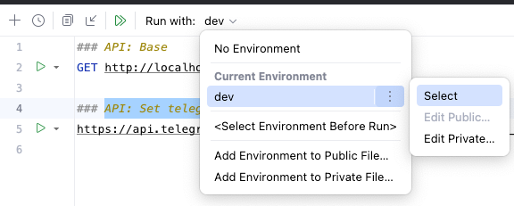
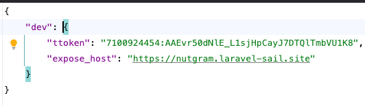

# Запуск и установка Webhook локально

> Используется [Expose](https://expose.dev/) - expose local sites via secure tunnels
>
> Открывается публичный доступ к локальному приложению и регистрируется **webhook** для Telegram Bot API

**Инструкция**:

1. Регистрируемся на сайте [expose.dev](https://expose.dev/)
2. Установка Expose на локальную среду: `composer global require beyondcode/expose`
3. Аутентификация для expose: `expose token {{token}}` - **token** генерирует сам Expose
4. Открываем доступ: `expose share http://localhost`
5. Открываем файл [requests.http](../requests.http)
6. Открываем настройка переменных окружения:

7. Задаем значения для дальнейших запросов

8. Отправляем запрос в Telegram Bot API для регистрации webhook: `https://api.telegram.org/bot{{ttoken}}/setWebhook?url={{expose_host}}/api/webhook`
9. Тестируем телеграм бот
